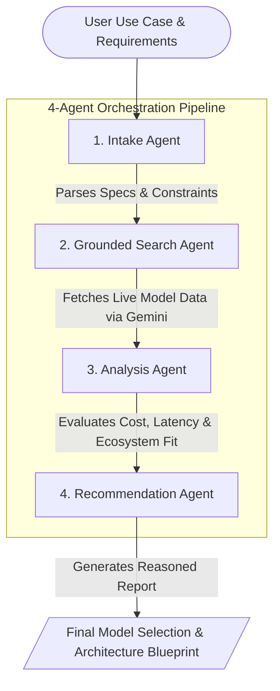

# AI Model Advisor

A Spring Boot 3.4 Java application that recommends AI models for a user-supplied use case through a four-agent pipeline. The app uses the Google Gemini REST API with `gemini-2.5-flash`; the search stage uses Gemini's native Google Search grounding rather than a separate Google Custom Search API integration.


## What It Does

Given a natural-language use case, the application:

1. Converts the use case into structured requirements.
2. Uses Gemini with Google Search grounding to discover current model candidates.
3. Scores candidates across capability, speed, cost, and ecosystem fit.
4. Produces a structured recommendation with a primary pick, runner-up, budget pick, dark horse, decision framework, cost estimate, and data disclaimer.

## Tech Stack

- Java 17
- Gradle
- Spring Boot 3.4
- OkHttp
- Gson
- Google Gemini `generateContent` API
- Docker

## Configuration

The only required API configuration is:

```powershell
$env:GOOGLE_API_KEY = "your-google-api-key"
```

On macOS or Linux:

```bash
export GOOGLE_API_KEY="your-google-api-key"
```

The app reads the following optional environment variables:

| Variable | Default | Purpose |
| --- | --- | --- |
| `PORT` | `8080` | Spring server port, read through `application.properties`. |
| `AGENT_TYPE` | unset | Restricts a service to one agent controller. Valid values: `intake`, `search`, `analysis`, `recommendation`. When unset, all agent controllers are enabled. |
| `INTAKE_AGENT_URL` | `http://localhost:8080/intake/process` | Pipeline URL for the intake agent. |
| `SEARCH_AGENT_URL` | `http://localhost:8080/search/process` | Pipeline URL for the search agent. |
| `ANALYSIS_AGENT_URL` | `http://localhost:8080/analysis/process` | Pipeline URL for the analysis agent. |
| `RECOMMENDATION_AGENT_URL` | `http://localhost:8080/recommendation/process` | Pipeline URL for the recommendation agent. |

Spring Boot's relaxed binding maps `AGENT_TYPE` to the `agent.type` property used by the controllers.

## Running Locally

Start the Spring Boot service:

```powershell
gradle bootRun
```

Then call the full pipeline over HTTP:

```powershell
Invoke-RestMethod "http://localhost:8080/run?useCase=RAG%20chatbot%20over%20internal%20docs%2C%20500%20queries%20per%20day%2C%20under%202s%20latency%2C%20startup%20budget"
```

You can also run the console pipeline:

```powershell
gradle run --args="RAG chatbot over internal docs, 500 queries/day, under 2s latency, startup budget"
```

If no arguments are provided to `gradle run`, the console app prompts for a use case and falls back to a built-in example when the input is blank.

## HTTP API

### Full Pipeline

```http
GET /run?useCase=<description>
```

Returns a `Recommendation` JSON object.

### Individual Agent Endpoints

```http
POST /intake/process
Content-Type: application/json

{
  "useCase": "RAG chatbot over internal docs, 500 queries/day, under 2s latency"
}
```

```http
POST /search/process
Content-Type: application/json

{
  "useCaseSummary": "...",
  "primaryTask": "search_rag",
  "contextWindowNeeded": "large_128k",
  "latencySensitivity": "interactive",
  "costSensitivity": "balanced",
  "multimodalNeeded": false,
  "toolUseNeeded": true,
  "openSourcePreferred": false,
  "selfHostNeeded": false,
  "volume": "medium",
  "deploymentTarget": "cloud_api",
  "searchQueries": ["..."],
  "keyRequirements": ["..."]
}
```

```http
POST /analysis/process
Content-Type: application/json

{
  "requirements": { },
  "findings": { }
}
```

```http
POST /recommendation/process
Content-Type: application/json

{
  "requirements": { },
  "findings": { },
  "analysis": { }
}
```

The individual endpoint contracts are defined in `src/main/java/com/devcamp/advisor/model/AgentModels.java` and `src/main/java/com/devcamp/advisor/model/AgentRequests.java`.

## Project Structure

| Path | Purpose |
| --- | --- |
| `src/main/java/com/devcamp/advisor/AdvisorApplication.java` | Spring Boot entry point and bean wiring. |
| `src/main/java/com/devcamp/advisor/config/AppConfig.java` | Environment-backed Gemini configuration. |
| `src/main/java/com/devcamp/advisor/util/DefaultModel.java` | Shared Gemini REST client and JSON helper. |
| `src/main/java/com/devcamp/advisor/agent/IntakeAgent.java` | Converts free text use cases into structured requirements. |
| `src/main/java/com/devcamp/advisor/agent/SearchAgent.java` | Performs grounded web discovery and extracts model candidates. |
| `src/main/java/com/devcamp/advisor/agent/AnalysisAgent.java` | Scores candidates against the requirements. |
| `src/main/java/com/devcamp/advisor/agent/RecommendationAgent.java` | Produces the final recommendation object. |
| `src/main/java/com/devcamp/advisor/controller/*Controller.java` | HTTP endpoints for the pipeline and each agent. |
| `src/main/java/com/devcamp/advisor/pipeline/AdvisorPipeline.java` | HTTP orchestrator and console entry point. |
| `src/main/resources/application.properties` | Server port and logging defaults. |
| `build.gradle` | Gradle build, application, and Spring Boot configuration. |
| `Dockerfile` | Multi-stage container build for the Spring Boot app. |

## Docker

Build the container:

```powershell
docker build -t ai-model-advisor .
```

Run all agent endpoints in one service:

```powershell
docker run --rm -p 8080:8080 -e GOOGLE_API_KEY="your-google-api-key" ai-model-advisor
```

Run a single agent endpoint:

```powershell
docker run --rm -p 8081:8080 `
  -e GOOGLE_API_KEY="your-google-api-key" `
  -e AGENT_TYPE="intake" `
  ai-model-advisor
```

## Cloud Run Deployment

The same container can run either the full service or one agent controller. For separate Cloud Run services, deploy the image multiple times with different `AGENT_TYPE` values:

```bash
gcloud run deploy intake \
  --image gcr.io/PROJECT_ID/ai-model-advisor \
  --set-env-vars GOOGLE_API_KEY=YOUR_KEY,AGENT_TYPE=intake
```

Repeat with `AGENT_TYPE=search`, `AGENT_TYPE=analysis`, and `AGENT_TYPE=recommendation`.

For the service that exposes `/run`, set the remote agent URLs so `AdvisorPipeline` calls the deployed services:

```bash
gcloud run deploy advisor-pipeline \
  --image gcr.io/PROJECT_ID/ai-model-advisor \
  --set-env-vars GOOGLE_API_KEY=YOUR_KEY,INTAKE_AGENT_URL=https://intake-url/intake/process,SEARCH_AGENT_URL=https://search-url/search/process,ANALYSIS_AGENT_URL=https://analysis-url/analysis/process,RECOMMENDATION_AGENT_URL=https://recommendation-url/recommendation/process
```

## Build and Test

Build the project:

```powershell
gradle build
```

Run tests:

```powershell
gradle test
```

The build declares JUnit and Spring Boot test dependencies, but this repository currently does not include test source files.

## Notes

- `GOOGLE_API_KEY` is required at application startup because `AppConfig` validates it during bean creation.
- Grounded search happens inside `SearchAgent` through Gemini's `google_search` tool configuration.
- The pipeline communicates with agents over JSON HTTP calls even when everything runs in the same Spring Boot process.
- The Dockerfile uses `gradle:8.5-jdk17` for the build stage and `openjdk:17-jdk-slim` for runtime.
